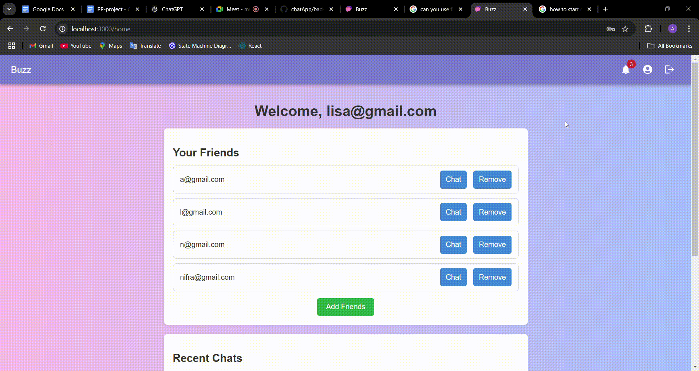
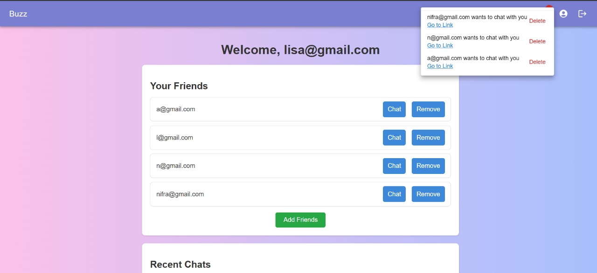
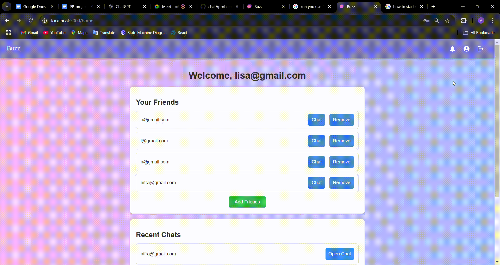
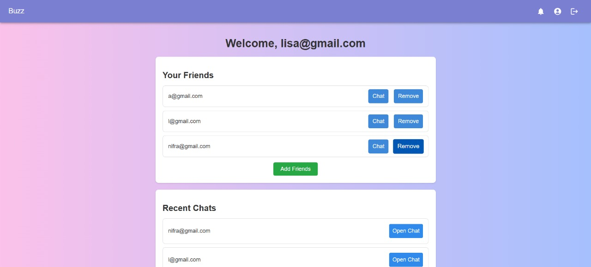
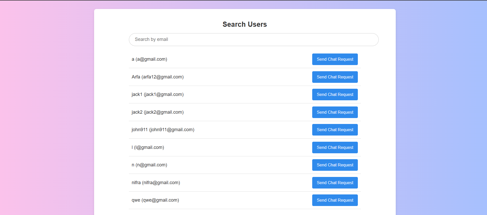
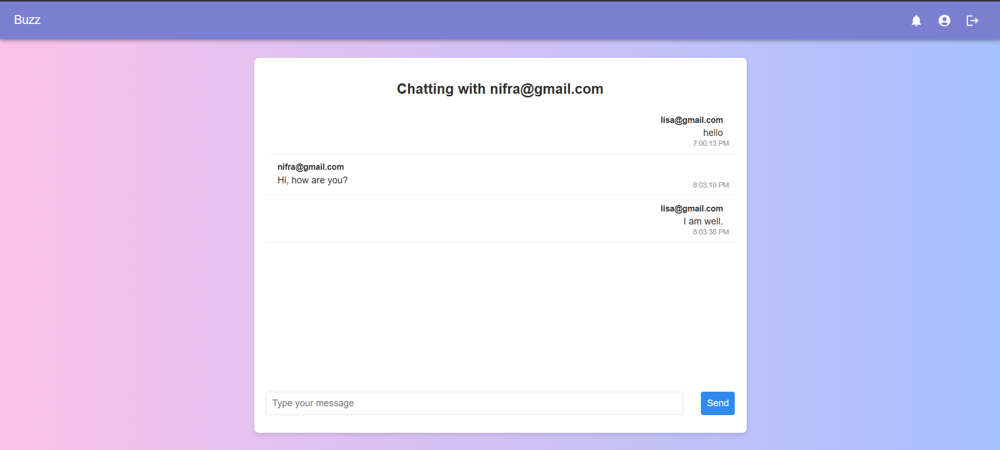
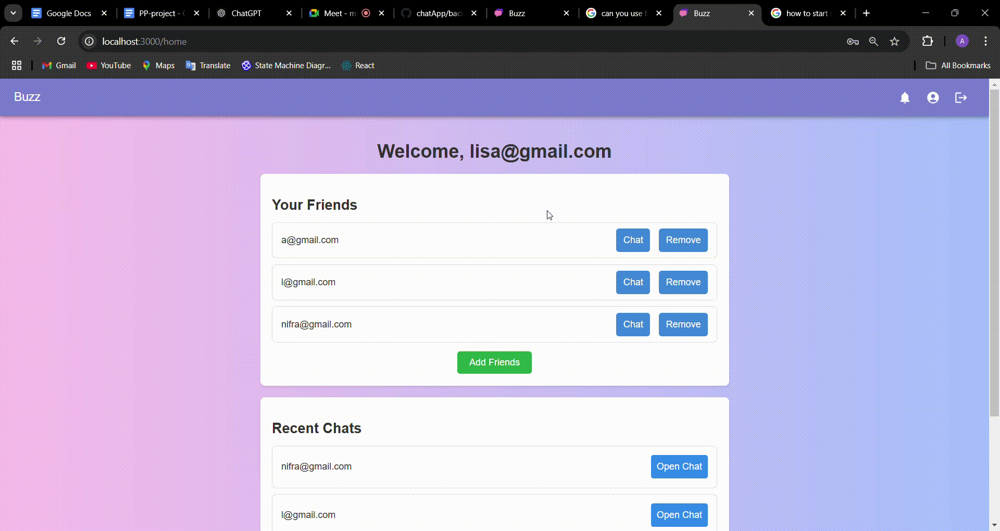

# Buzz - Chat Application

A real-time chat application to connect, chat, and share moments. The app allows users to send chat requests, accept/reject them, and chat in real time. It also supports Google OAuth for seamless login and includes notifications, friend management, and responsive UI.

## Features

1. **User Authentication**:

   - Login and Signup functionality.
   - Google OAuth login for quick access.
   - Password hashing for secure user accounts.
2. **Chat Features**:

   - **One-to-One Chat**: Real-time chat using WebSockets (Socket.IO).
   - Message history stored in MongoDB.
   - Timestamped messages for better organization.
3. **Friend Management**:

   - Send, accept, and reject chat requests.
   - Add and manage friends in a dedicated friends list.
4. **Notifications**:

   - Real-time notifications for chat requests and messages.
   - Mark notifications as read or delete them.
5. **Responsive Design**:

   - Fully responsive UI optimized for mobile and desktop.
   - Clean, modern design with interactive elements.

## Tech Stack

- **Frontend**: React.js, Material-UI, CSS
- **Backend**: Node.js, Express.js
- **Database**: MongoDB
- **Real-Time Communication**: Socket.IO
- **Authentication**: Passport.js (Google OAuth)
- **Hosting**: Localhost (development environment)

## Screenshots

Homepage

Notification Button Click

Profile Button Click

Remove Friend

Add Friends Button Click

Chat Page

Logout, Login, Signup

## Project Structure

### Backend

 **Models** :
* `Chat`: Handles message history and participants for chats.
* `ChatRequest`: Manages chat request statuses.
* `Group`: Schema for managing group chats (to be implemented).
* `Notification`: Schema for notifications.
* `User`: Schema for user profiles, including friends and notifications.
 **Routes** :
* `/auth`: Manages user authentication and Google OAuth.
* `/chat`: Handles chat creation and real-time communication.
* `/users`: Fetches user and friend data.
* `/notifications`: Manages notifications.

### Frontend

* **Pages** :
* `LoginPage`: Login functionality with Google OAuth.
* `SignupPage`: User signup with validation.
* `HomePage`: Displays friends, chat list, and notifications.
* `ChatRequestPage`: Manage pending chat requests.
* `ChatPage`: Real-time chat interface.
* `DefaultPage`: Landing page for the application.

## API Endpoints

### Authentication

* `POST /signup`: Create a new user account.
* `POST /login`: Log in with email and password.
* `GET /auth/google`: Initiate Google OAuth login.
* `GET /auth/google/callback`: Handle Google OAuth callback.

### Users

* `GET /get-user`: Get the logged-in user's details.
* `GET /all-users`: Fetch all registered users.
* `GET /get-friends`: Fetch the user's friend list.

### Chat

* `POST /create-or-fetch-chat`: Create or retrieve a one-to-one chat.

### Chat Requests

* `POST /send-chat-request`: Send a chat request.
* 
* `POST /accept-chat-request`: Accept a chat request.
* `POST /reject-chat-request`: Reject a chat request.

### Notifications

* `GET /notifications`: Fetch all notifications.
* `PUT /update-notification/:id`: Mark a notification as read.
* `DELETE /delete-notification/:id`: Delete a notification.

---
